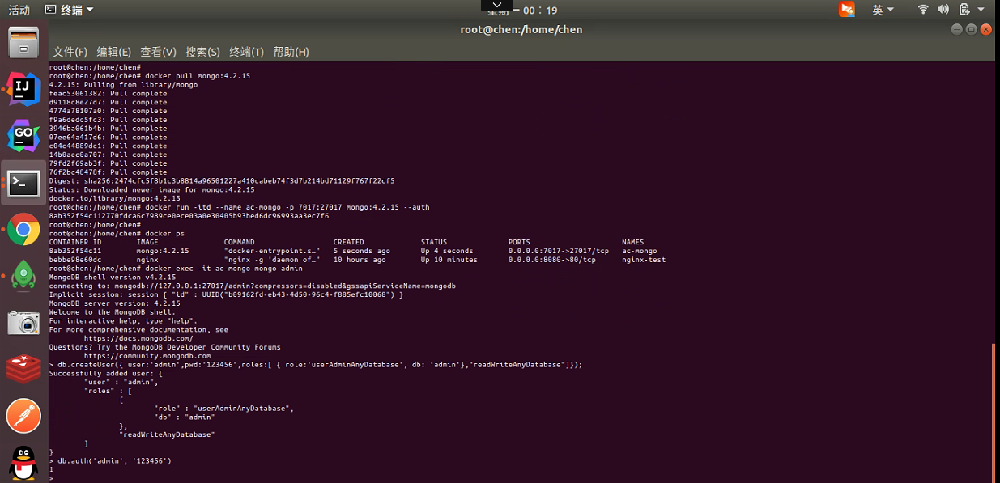
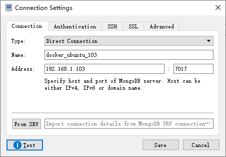
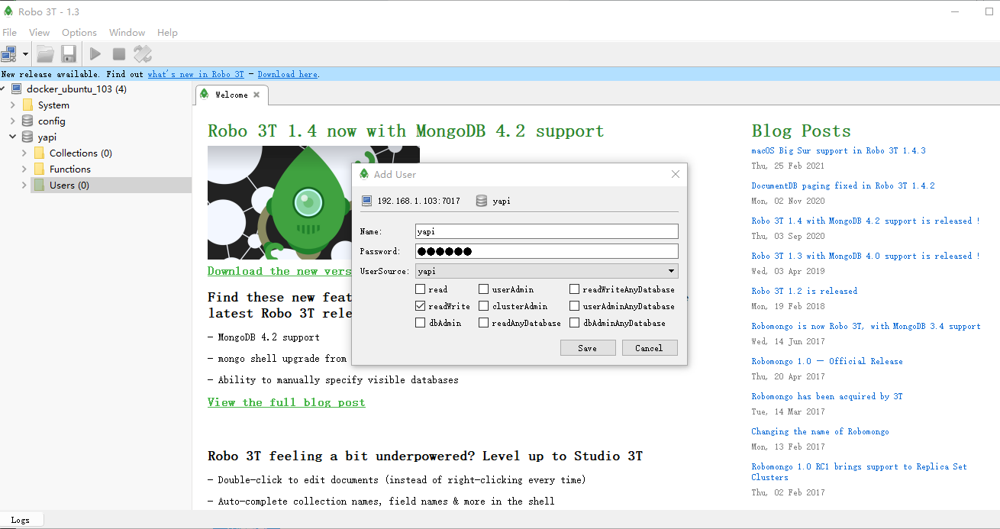
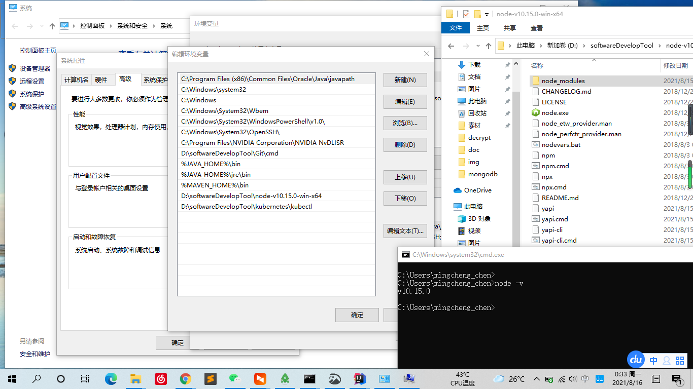
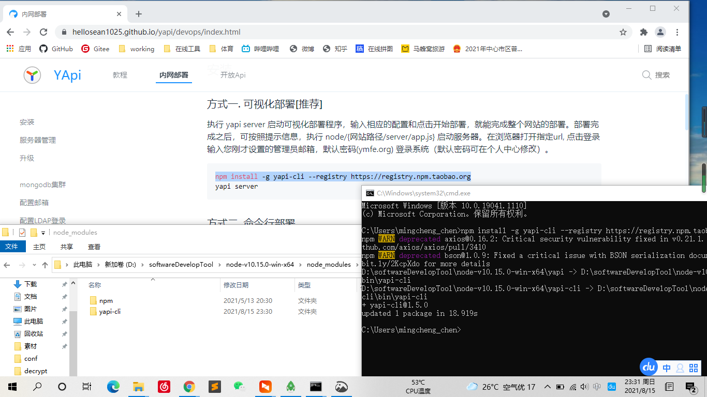
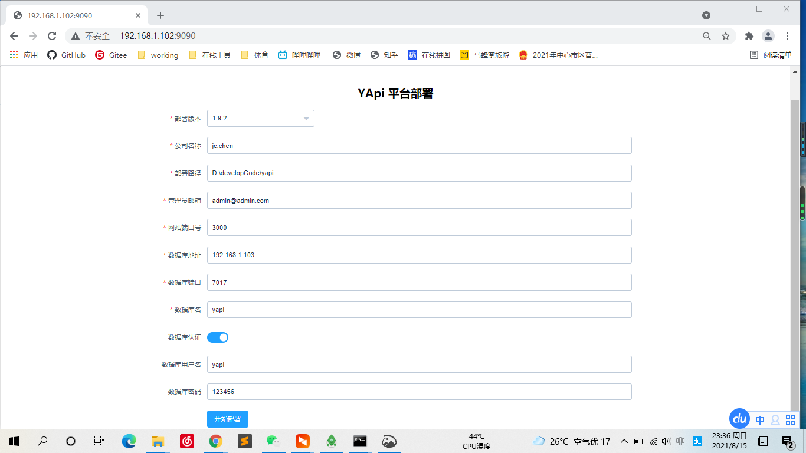
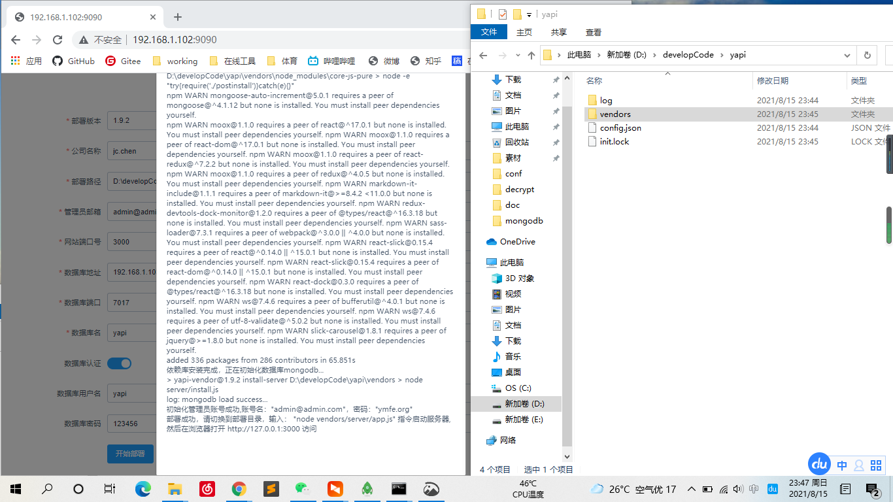
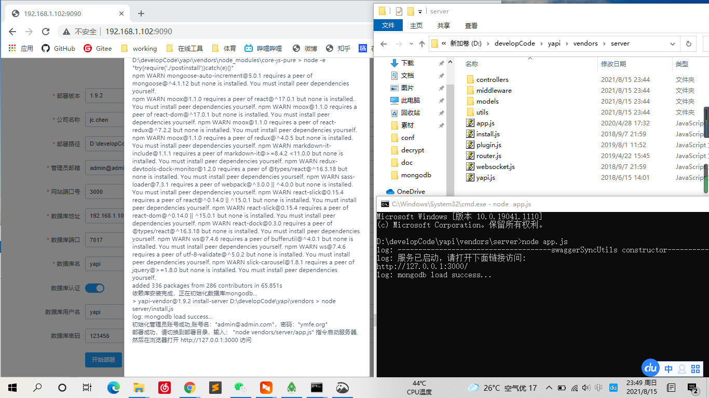

# WINDOWS系统部署YApi应用
[1.官网博客](https://hellosean1025.github.io/yapi/devops/index.html)
[2.官网Github](https://github.com/ymfe/yapi)

## 安装mongodb数据库(docker方式)

- 相关安装配置命令(安装版本4.2.15)
```text
docker pull mongo:latest (ubuntu使用高版本无法启动)
docker pull mongo:4.2.15 
docker images
docker ps
docker run -itd --name ac-mongo -p 7017:27017 mongo --auth
docker exec -it ac-mongo mongo admin
db.createUser({ user:'admin',pwd:'123456',roles:[ { role:'userAdminAnyDatabase', db: 'admin'},"readWriteAnyDatabase"]});
db.auth('admin', '123456')
docker logs ac-mongo
```



- 使用admin创建用于yapi的数据库




## 安装 Node.js（安装版本v10.15.0）
```text
采用解压方式安装，并配置环境变量即可
```



## 部署YApi应用
- 安装部署程序



- 启动部署程序


- 配置YApi应用



- 执行YApi应用部署


- 部署结果确认



- 启动YApi应用

